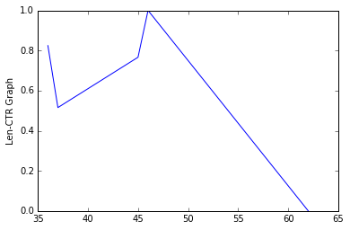
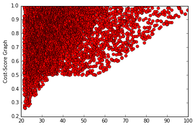

# Albert - Adgorithms Optimization Developer Exercise

#### 1.Find the best performing ad of the given time period


```python
import csv
import numpy as np

# load a csv
NUMBER_OF_LINES  = "Number of lines"
with open(r'C:\Users\hilatash\Downloads\albert\albert_dev_test.csv') as csvfile:
        readCSV = csv.reader(csvfile, delimiter=',')
        data = []
        i = 0
        lines = 0
        #parse number of lines from data
        for row in readCSV:
            if NUMBER_OF_LINES in row[0]:
                lines = int(row[0].split("-")[1])
                #next line is #
                readCSV.next()
                break

        #parse data into list
        for row in readCSV:
            if i < lines + 1:
                data.append(row)
            i = i + 1

        #convert list to dict with the relevants headlines
        ads_list = []
        dict_of_ads = {}
        headlines = data[0]
        #remove headlines from the data
        data.remove(data[0])
        ad_number = 1
        for line in data:
            ad_dict = {}
            ad_dict[headlines[0]] = line[0]
            ad_dict[headlines[1]] = line[1]
            ad_dict[headlines[2]] = line[2]
            ad_dict[headlines[3]] = line[3]
            ad_dict[headlines[4]] = line[4]
            ad_dict[headlines[5]] = line[5]
            ad_dict[headlines[6]] = line[6]
            ad_dict[headlines[7]] = line[7]
            ads_list.append(ad_dict)
            dict_of_ads[ad_number] = ad_dict
            ad_number += 1


        #Find the best performing ad of the given time period.
        best_ad_performance = -1
        best_ad_in_period = None
        for ad in ads_list:
            try:
                clicks = ad['clicks']
                impressions = ad['impressions']
                ad['CTR'] = float(clicks) /float(impressions)
            except Exception:
                ad['CTR'] = 0
            if ad['CTR'] > best_ad_performance:
                best_ad_performance = ad['CTR']
                best_ad_in_period = ad
        
        print "The best performing ad of the given time period - "
        print best_ad_in_period['headLine']
        print best_ad_in_period['bodyText'] 
        


```

    The best performing ad of the given time period - 
    Sporting Goods - The place for you!
    forget everything you know about sports
    

####   2. Find the best performing ad of each day within the time period.


```python
import csv
import numpy as np

# load a csv
NUMBER_OF_LINES  = "Number of lines"
with open(r'C:\Users\hilatash\Downloads\albert\albert_dev_test.csv') as csvfile:
        readCSV = csv.reader(csvfile, delimiter=',')
        data = []
        i = 0
        lines = 0
        #parse number of lines from data
        for row in readCSV:
            if NUMBER_OF_LINES in row[0]:
                lines = int(row[0].split("-")[1])
                #next line is #
                readCSV.next()
                break

        #parse data into list
        for row in readCSV:
            if i < lines + 1:
                data.append(row)
            i = i + 1

        #convert list to dict with the relevants headlines
        ads_list = []
        dict_of_ads = {}
        headlines = data[0]
        #remove headlines from the data
        data.remove(data[0])
        ad_number = 1
        for line in data:
            ad_dict = {}
            ad_dict[headlines[0]] = line[0]
            ad_dict[headlines[1]] = line[1]
            ad_dict[headlines[2]] = line[2]
            ad_dict[headlines[3]] = line[3]
            ad_dict[headlines[4]] = line[4]
            ad_dict[headlines[5]] = line[5]
            ad_dict[headlines[6]] = line[6]
            ad_dict[headlines[7]] = line[7]
            ads_list.append(ad_dict)
            dict_of_ads[ad_number] = ad_dict
            ad_number += 1


        #Find the best performing ad of the given time period.
        #sdd CTR key calculate ...#todo
        best_ad_performance = -1
        best_ad_in_period = None
        for ad in ads_list:
            try:
                clicks = ad['clicks']
                impressions = ad['impressions']
                ad['CTR'] = float(clicks) /float(impressions)
            except Exception:
                ad['CTR'] = 0
            if ad['CTR'] > best_ad_performance:
                best_ad_performance = ad['CTR']
                best_ad_in_period = ad

        #Find the best performing ad of each day within the time period.
        #create dict of days , for each day will be list of ads of this day
        #for example: ads_per_day['10.10.2016'] = {ad1,ad2,ad3}

        day = {}
        ads_per_day_dict = {}
        #create dict of empty lists
        for ad in ads_list:
            ads_per_day_dict[ad['date']] = []
        #add ads to list of ads per day
        for ad in ads_list:
            ads_per_day_dict[ad['date']].append(ad)

        best_ad_per_day = {}
        for date in ads_per_day_dict:
            best_ad_performance = -1
            for ad in ads_per_day_dict[date]:
                if ad['CTR'] > best_ad_performance:
                    best_ad_performance = ad['CTR']
                    best_ad = ad
            best_ad_per_day[date] = best_ad


        import pandas as pd
        print "Find the best performing ad of each day within the time period - "
        df = pd.DataFrame(columns=['best_ad_per_day'])
        for date in  best_ad_per_day:
            ad =  best_ad_per_day[date]['headLine'] +","+ best_ad_per_day[date]['bodyText']
            df.loc[date] = ad

        print df
```

    Find the best performing ad of each day within the time period - 
                                                  best_ad_per_day
    2016-10-19      Goods buy sports,don't do sports, its not fun
    2016-10-18             Buy sporting goods,balls, balls balls!
    2016-10-30      Goods buy sports,don't do sports, its not fun
    2016-10-15  Sporting Goods - The place for you!,Now socks ...
    2016-10-14  Buy sporting goods,forget everything you know ...
    2016-10-17  Sporting The Goods,forget everything you know ...
    2016-10-16  Goods buy sports,forget everything you know ab...
    2016-10-11             Buy sporting goods,balls, balls balls!
    2016-10-10  Buy sporting goods,forget everything you know ...
    2016-10-13  Sporting The Goods,forget everything you know ...
    2016-10-12             Sporting The Goods,balls, balls balls!
    2016-10-08             Sporting The Goods,balls, balls balls!
    2016-10-27             Buy sporting goods,balls, balls balls!
    2016-10-28  Sporting Goods - The place for you!,Now socks ...
    2016-10-07      Goods buy sports,don't do sports, its not fun
    2016-10-20  Sporting Goods - The place for you!,forget eve...
    2016-10-21  Sporting Goods - The place for you!,forget eve...
    2016-10-22              Buy sporting goods,Now socks on sale!
    2016-10-23             Buy sporting goods,balls, balls balls!
    2016-10-24             Buy sporting goods,balls, balls balls!
    2016-10-25  Buy sporting goods,forget everything you know ...
    2016-10-26  Sporting Goods - The place for you!,forget eve...
    2016-10-09  Buy sporting goods,forget everything you know ...
    2016-10-06             Buy sporting goods,balls, balls balls!
    2016-10-29              Sporting The Goods,Now socks on sale!
    2016-10-04    Buy sporting goods,don't do sports, its not fun
    2016-10-05  Sporting The Goods,forget everything you know ...
    2016-10-02                Goods buy sports,Now socks on sale!
    2016-10-03     Buy sporting goods,golf balls are the new rage
    2016-10-01              Buy sporting goods,Now socks on sale!
    

#### 3.Provide the ids and statistics of the best performing ad group and campaign for the given time


```python
import csv
import numpy as np

# load a csv
NUMBER_OF_LINES  = "Number of lines"
with open(r'C:\Users\hilatash\Downloads\albert\albert_dev_test.csv') as csvfile:
        readCSV = csv.reader(csvfile, delimiter=',')
        data = []
        i = 0
        lines = 0
        #parse number of lines from data
        for row in readCSV:
            if NUMBER_OF_LINES in row[0]:
                lines = int(row[0].split("-")[1])
                #next line is #
                readCSV.next()
                break

        #parse data into list
        for row in readCSV:
            if i < lines + 1:
                data.append(row)
            i = i + 1

        #convert list to dict with the relevants headlines
        ads_list = []
        dict_of_ads = {}
        headlines = data[0]
        #remove headlines from the data
        data.remove(data[0])
        ad_number = 1
        for line in data:
            ad_dict = {}
            ad_dict[headlines[0]] = line[0]
            ad_dict[headlines[1]] = line[1]
            ad_dict[headlines[2]] = line[2]
            ad_dict[headlines[3]] = line[3]
            ad_dict[headlines[4]] = line[4]
            ad_dict[headlines[5]] = line[5]
            ad_dict[headlines[6]] = line[6]
            ad_dict[headlines[7]] = line[7]
            ads_list.append(ad_dict)
            ad_number += 1    
        
        #Find the best performing ad of the given time period.
        best_ad_performance = -1
        best_ad_in_period = None
        for ad in ads_list:
            try:
                clicks = ad['clicks']
                impressions = ad['impressions']
                ad['CTR'] = float(clicks) /float(impressions)
            except Exception:
                ad['CTR'] = 0
            if ad['CTR'] > best_ad_performance:
                best_ad_performance = ad['CTR']
                best_ad_in_period = ad
        
        #Provide the ids and statistics of the best performing ad group and campaign for the given time
        from collections import defaultdict
        #create dict of camps that each include dict of groups that include list of ads
        #for example d['camp1']->['group1'],['group2']
        #d['camp1']->['group1']->{ad1,ad2,ad3}
        outerdict = defaultdict(lambda: defaultdict(list))
        for ad in ads_list:
            outerdict[ad['campaign']][ad['adGroupId']].append(ad)
        #check the best score
        best_group_scroe = 0
        best_score = 0
        best_result_group = None
        best_result_camp = None
        for camp in outerdict:
            for group in outerdict[camp]:
                group_sum = 0
                #calculate the score of all ads in group a and campaign b
                for ad in  outerdict[camp][group]:
                    group_sum +=ad['CTR']
                if group_sum > best_group_scroe:
                    best_group_scroe = group_sum
                    best_result_group = group
            if best_group_scroe > best_score:
                best_score = best_group_scroe
                best_result_camp = camp
        print "best result camp: " + best_result_camp
        print "best group id: " + best_result_group

        df = pd.DataFrame(columns=['date','impressions','clicks','cost'])
        i = 0
        for ad in outerdict[best_result_camp][best_result_group]:
            df.loc[i] = [ad['date'],ad['impressions'],ad['clicks'],ad['cost']]
            i +=1
        print df


```

    best result camp: #Albert_**[8327983]**_Current_campaign
    best group id: 1899689
               date impressions clicks                cost
    0    2016-10-22        6577   6419              42.095
    1    2016-10-30        3081    542               12.71
    2    2016-10-26        8148   1562  17.810000000000002
    3    2016-10-05         810    415              12.075
    4    2016-10-06         231     60                10.3
    5    2016-10-01         410    132               10.66
    6    2016-10-19        6232   1615              18.075
    7    2016-10-20        6608   2569              22.845
    8    2016-10-23         253     68               10.34
    9    2016-10-24        5803   1252  16.259999999999998
    10   2016-10-29        3922    339              11.695
    11   2016-10-01         618    547              12.735
    12   2016-10-16        5140   2823  24.115000000000002
    13   2016-10-03        1447    974  14.870000000000001
    14   2016-10-28       12265  11006               65.03
    15   2016-10-29        2291    836               14.18
    16   2016-10-11          79     66               10.33
    17   2016-10-15        2152   1428               17.14
    18   2016-10-05         702    690               13.45
    19   2016-10-14        9279   7964               49.82
    20   2016-10-17        5401   3188  25.939999999999998
    21   2016-10-04        1191   1032               15.16
    22   2016-10-30        3956   3742               28.71
    23   2016-10-07         934    886               14.43
    24   2016-10-29        6257   3188  25.939999999999998
    25   2016-10-14        7359   6562               42.81
    26   2016-10-11        1250    157              10.785
    27   2016-10-03         450    361              11.805
    28   2016-10-05        1283   1256               16.28
    29   2016-10-04        1129   1097              15.485
    ..          ...         ...    ...                 ...
    210  2016-10-22         620    576  12.879999999999999
    211  2016-10-24        5277   4733              33.665
    212  2016-10-16        2494   1364               16.82
    213  2016-10-20        2977    560                12.8
    214  2016-10-28        2254   1290               16.45
    215  2016-10-01         716    662               13.31
    216  2016-10-08        2277   1961              19.805
    217  2016-10-02         864    493              12.465
    218  2016-10-19        3886     --                  --
    219  2016-10-24        6004    964               14.82
    220  2016-10-25        1891   1076  15.379999999999999
    221  2016-10-14        2310   2216               21.08
    222  2016-10-22        4885   1503              17.515
    223  2016-10-25         243     --                  --
    224  2016-10-08        2793   1067              15.335
    225  2016-10-13        4075     31              10.155
    226  2016-10-22        4357   2313  21.564999999999998
    227  2016-10-28        4098   3233              26.165
    228  2016-10-30         782    737              13.685
    229  2016-10-12        2224    561              12.805
    230  2016-10-27        5829   5153              35.765
    231  2016-10-22        6534   2437  22.185000000000002
    232  2016-10-03        1418    867              14.335
    233  2016-10-30        8168   7889              49.445
    234  2016-10-03         822     --                  --
    235  2016-10-27        6161   4088               30.44
    236  2016-10-06         489    263              11.315
    237  2016-10-15        1002    539              12.695
    238  2016-10-12        2523   1356               16.78
    239  2016-10-11        1246    632               13.16
    
    [240 rows x 4 columns]
    

#### 4.For each ad group, state if it is in the lower quartile of its campaign in terms of impressions


```python
        #For each ad group, state if it is in the lower quartile of its campaign in terms of impressions
        groups = {}
        impressions_for_group = {}
        ad_group_id_result = {}
        for camp in outerdict:
            camp_impressions = 0
            for group in outerdict[camp]:
                group_impressions = 0
                #calculate the num of group impressions
                for ad in  outerdict[camp][group]:
                    group_impressions += int(ad['impressions'])
                    camp_impressions += int(ad['impressions'])
                impressions_for_group[group] = group_impressions

            for group in impressions_for_group:
                if impressions_for_group[group] < (camp_impressions / 4):
                    groups[group] = "lower"
                else:
                    groups[group] = "higer"
        
        
        #print the results
        print str(groups)

```

    {'5807362': 'lower', '8293668': 'lower', '1866565': 'higer', '8569794': 'higer', '4313194': 'higer', '4971442': 'lower', '6014739': 'lower', '3903713': 'higer', '4855135': 'lower', '3615100': 'higer', '4485830': 'lower', '5868614': 'higer', '7971631': 'higer', '2383411': 'lower', '9451923': 'higer', '7722033': 'higer', '8541554': 'lower', '2010461': 'lower', '3792257': 'lower', '4015172': 'higer', '4944523': 'higer', '9575470': 'lower', '4006933': 'higer', '7311131': 'lower', '9168766': 'lower', '4939747': 'higer', '6345811': 'higer', '6959614': 'lower', '7672563': 'higer', '2463253': 'lower', '6300436': 'higer', '9491413': 'higer', '3576949': 'higer', '4442461': 'higer', '2866165': 'higer', '4763817': 'higer', '4764110': 'higer', '3577787': 'lower', '5941016': 'lower', '8841866': 'higer', '3163353': 'lower', '7459969': 'higer', '1177231': 'lower', '2585424': 'higer', '9605519': 'higer', '3549150': 'lower', '2410919': 'higer', '2832875': 'higer', '7796774': 'higer', '9292440': 'lower', '5677471': 'higer', '8741505': 'lower', '8257023': 'lower', '6488442': 'higer', '8778230': 'higer', '3095322': 'higer', '5175939': 'higer', '2449071': 'higer', '1899689': 'higer', '8385118': 'lower', '3179271': 'higer', '5284053': 'higer', '4698902': 'higer', '4429509': 'lower', '7582227': 'higer', '6327620': 'lower', '8163940': 'higer', '8302218': 'lower', '8430359': 'higer', '3902573': 'higer', '3416165': 'higer', '5813436': 'lower', '4956049': 'lower', '7379622': 'higer', '3939385': 'higer', '4975245': 'lower', '4287974': 'lower', '3789344': 'higer', '2794197': 'higer', '3048169': 'higer', '4638799': 'higer', '5188263': 'higer', '4408005': 'higer', '3486363': 'higer', '9198695': 'higer', '1174996': 'lower', '7924778': 'higer', '8031715': 'higer', '1489318': 'lower', '5944683': 'lower', '8837791': 'higer', '5824565': 'higer', '9551915': 'higer', '5474141': 'lower', '3264884': 'higer', '8014850': 'higer', '4688329': 'higer', '4047866': 'higer', '6680145': 'lower', '1874413': 'higer', '2805337': 'higer', '1622823': 'higer', '9830440': 'higer', '4245589': 'higer', '2288812': 'higer', '5200888': 'higer', '2885804': 'higer', '1200893': 'higer', '5049780': 'lower', '3419063': 'higer', '4842318': 'higer', '5152640': 'lower', '5386927': 'higer', '1154125': 'lower', '8848686': 'lower', '8124925': 'higer', '6117972': 'higer', '8469876': 'lower', '9816779': 'higer', '4137722': 'higer', '8951273': 'lower', '5123061': 'lower', '6228142': 'higer', '6633057': 'lower', '3943837': 'lower', '5194661': 'higer', '1069535': 'higer', '9736636': 'lower', '9506390': 'lower', '7452900': 'higer', '5475294': 'lower', '2631343': 'lower', '6792441': 'lower', '1536304': 'higer', '3736390': 'higer', '9879071': 'lower', '3714450': 'lower', '9228053': 'lower', '5424344': 'lower', '3979814': 'higer', '8660897': 'lower', '3429400': 'higer', '9954073': 'higer', '3422129': 'lower', '9463970': 'higer', '6175985': 'lower', '7025720': 'higer', '5165908': 'higer', '4031885': 'lower', '2802729': 'higer', '8025166': 'lower', '4921971': 'higer', '7612319': 'lower', '1372466': 'higer', '5200260': 'higer', '1363173': 'lower', '2565352': 'lower', '6741507': 'higer', '9467087': 'lower', '7554473': 'lower', '4156678': 'lower', '1934499': 'higer', '4542110': 'lower', '1125634': 'lower', '1791538': 'lower', '4390227': 'lower', '9989555': 'lower', '6262873': 'higer', '5942799': 'lower', '9187421': 'higer', '5075451': 'higer', '9577834': 'lower', '3020291': 'higer', '5594366': 'lower', '8191415': 'lower', '1432606': 'higer', '5401841': 'lower', '3957866': 'lower', '2235236': 'higer', '2127071': 'lower', '8007878': 'higer', '5453287': 'lower', '2652087': 'lower', '4435726': 'lower', '4858877': 'higer', '9829701': 'lower', '8434792': 'higer', '6022513': 'lower', '6102965': 'lower', '8899367': 'higer', '7062934': 'lower', '5866085': 'higer', '7091824': 'lower', '2485831': 'lower', '7160069': 'higer', '2039299': 'lower', '8723647': 'lower', '1119945': 'lower', '9650298': 'higer', '2319724': 'lower', '7487205': 'higer', '3301863': 'higer', '4242437': 'higer', '2456166': 'higer', '9612043': 'higer', '9116416': 'higer', '7768270': 'higer', '7012252': 'lower', '5081707': 'higer', '8488646': 'lower', '8653523': 'higer', '4181364': 'higer', '7109304': 'higer', '3433304': 'higer', '8345364': 'lower', '7328398': 'higer', '4386257': 'lower', '7537766': 'higer', '4724646': 'lower', '8890195': 'lower', '4713214': 'higer', '5789874': 'higer', '1974993': 'higer', '6274736': 'lower', '6837235': 'higer', '3177419': 'higer', '5913822': 'lower', '3737325': 'lower', '3692407': 'lower', '1114350': 'higer', '3394234': 'higer', '1980772': 'lower', '9461148': 'lower', '8374019': 'lower', '3213323': 'higer', '8493281': 'lower', '3089264': 'higer', '5005861': 'higer', '8179300': 'lower', '4986077': 'lower', '5129507': 'lower', '1527239': 'lower', '2966028': 'higer', '4535846': 'lower', '4300783': 'lower', '2340139': 'lower', '9307897': 'lower', '1451398': 'lower', '7062368': 'higer', '2154589': 'lower', '6579772': 'lower', '1613520': 'lower', '8286734': 'higer', '9674289': 'lower', '8954266': 'higer', '9317823': 'lower', '3662151': 'lower', '8245782': 'higer', '1276217': 'higer', '9273730': 'higer', '8046998': 'higer', '9440344': 'higer', '7811335': 'higer', '5670784': 'lower', '7832932': 'lower', '9719546': 'lower', '1444921': 'higer', '2003113': 'higer', '9332987': 'higer', '6088312': 'lower', '6146419': 'higer', '8393514': 'higer', '1846944': 'lower', '7866794': 'higer', '5902875': 'higer', '9945123': 'higer', '5933581': 'higer', '1833167': 'higer', '1930357': 'higer', '5975079': 'higer', '9730242': 'higer', '1294384': 'higer', '8811363': 'higer', '9521780': 'higer', '9518604': 'lower', '3116275': 'lower', '1221066': 'higer', '1530388': 'higer', '3498900': 'higer', '8026482': 'higer', '3814914': 'lower', '9599676': 'higer', '8471725': 'lower', '8369278': 'higer', '7737941': 'higer', '8628618': 'lower', '4580071': 'higer', '7198390': 'lower', '2497550': 'higer', '1051479': 'higer', '4800207': 'lower', '3208340': 'higer', '9820563': 'higer', '5947450': 'lower', '4940610': 'higer', '9715008': 'lower', '2726335': 'higer', '9454366': 'higer', '2972117': 'higer', '1473984': 'lower', '8920191': 'higer', '5639223': 'higer', '3804489': 'lower', '5089982': 'higer', '6369462': 'higer', '7127383': 'higer', '7775816': 'lower', '6415458': 'higer', '6788815': 'higer', '4362846': 'higer', '4085120': 'lower', '7638799': 'lower', '3452660': 'lower', '9855139': 'higer', '8240096': 'higer', '6197149': 'lower', '6027135': 'lower', '4967500': 'higer', '3709177': 'higer', '5151780': 'higer', '9864183': 'higer', '6937897': 'lower', '7322776': 'higer', '8476363': 'lower', '9409750': 'lower', '1654669': 'lower', '7678273': 'higer', '5051924': 'lower', '9783082': 'lower', '2045520': 'lower', '3970959': 'lower', '3637365': 'lower', '4250434': 'higer', '3745262': 'lower', '9732274': 'higer', '2734711': 'higer', '7438484': 'higer', '7297024': 'higer', '5577103': 'higer', '5077594': 'higer', '5043242': 'higer', '3513344': 'lower', '8798834': 'lower', '2236553': 'higer', '5978861': 'higer', '8964601': 'higer', '5111050': 'lower', '3779317': 'lower', '3679925': 'lower', '2889236': 'lower', '7692546': 'higer', '1146974': 'higer', '3011710': 'higer', '1428234': 'higer', '2114510': 'higer', '3292821': 'lower', '1413521': 'lower', '6208456': 'higer', '5048086': 'lower', '1226462': 'lower', '4297163': 'higer', '5954685': 'higer', '4090832': 'higer', '7775695': 'lower', '4460555': 'higer', '2355699': 'higer', '4142892': 'lower', '1159774': 'lower', '3436333': 'lower', '5960024': 'lower', '1774209': 'higer', '7033738': 'higer', '2148679': 'higer', '3233227': 'lower', '6665807': 'lower', '4030177': 'lower', '5456200': 'lower', '5560641': 'lower', '3054649': 'higer', '3643296': 'lower', '4246427': 'higer', '7731367': 'higer', '4285753': 'lower', '4123372': 'higer', '1043138': 'higer', '2014703': 'lower', '9225532': 'lower', '4048508': 'lower', '1434770': 'higer', '7689957': 'lower', '8149013': 'higer', '3671741': 'lower', '4927068': 'lower', '5760458': 'lower', '8926691': 'lower', '4289840': 'lower', '8566493': 'lower', '4713417': 'higer', '5327832': 'higer', '9442954': 'lower', '6293783': 'higer', '2942783': 'lower', '7645694': 'lower', '3555115': 'lower', '2845171': 'higer', '7499424': 'lower', '9712245': 'higer', '4888444': 'lower', '3752877': 'higer', '7393287': 'lower', '2183268': 'higer', '6864353': 'lower', '4381338': 'higer', '1943239': 'lower', '3905191': 'lower', '9335959': 'higer', '5054658': 'lower', '7719701': 'higer', '8352632': 'lower', '4758398': 'higer', '9361782': 'higer', '8691736': 'higer', '7928023': 'higer', '3778595': 'lower', '6259763': 'higer', '1135791': 'lower', '4894125': 'lower', '6343998': 'lower', '5038559': 'higer', '7579342': 'lower', '8666333': 'lower', '5613437': 'lower', '2254104': 'lower', '6991060': 'lower', '6977738': 'higer', '9358628': 'lower', '5372581': 'higer', '8844321': 'higer', '6162419': 'lower', '6033675': 'lower', '1658261': 'lower', '1305669': 'higer', '9330990': 'higer', '3559042': 'lower', '5168537': 'lower', '4709772': 'lower', '5188951': 'lower', '8633185': 'higer', '1640929': 'higer', '3987251': 'lower', '3142294': 'higer', '8918071': 'lower', '6466722': 'higer', '7105438': 'higer', '5352858': 'lower', '8336085': 'higer', '4287549': 'higer', '6272339': 'lower', '2817498': 'lower', '5593428': 'higer', '5889724': 'lower', '1913778': 'higer', '9049931': 'lower', '3913362': 'lower', '9184941': 'lower', '8294544': 'lower', '7637821': 'higer', '9156733': 'higer', '9341013': 'higer', '2834727': 'higer', '3448866': 'higer', '5906956': 'lower', '3873101': 'higer', '8982889': 'higer', '7968968': 'higer', '1818703': 'higer', '6254022': 'lower', '5816860': 'higer', '8260076': 'higer', '8778462': 'higer', '1211991': 'lower', '4869296': 'lower', '8691268': 'lower', '6371596': 'higer', '7303458': 'higer', '7136842': 'lower', '3217616': 'higer', '6991877': 'higer', '8198550': 'higer', '7385173': 'higer'}
    

#### 5.Organize the ad groups by the following logic


```python
import csv
import numpy as np

# load a csv
NUMBER_OF_LINES  = "Number of lines"
with open(r'C:\Users\hilatash\Downloads\albert\albert_dev_test.csv') as csvfile:
        readCSV = csv.reader(csvfile, delimiter=',')
        data = []
        i = 0
        lines = 0
        #parse number of lines from data
        for row in readCSV:
            if NUMBER_OF_LINES in row[0]:
                lines = int(row[0].split("-")[1])
                #next line is #
                readCSV.next()
                break

        #parse data into list
        for row in readCSV:
            if i < lines + 1:
                data.append(row)
            i = i + 1

        #convert list to dict with the relevants headlines
        ads_list = []
        dict_of_ads = {}
        headlines = data[0]
        #remove headlines from the data
        data.remove(data[0])
        ad_number = 1
        for line in data:
            ad_dict = {}
            ad_dict[headlines[0]] = line[0]
            ad_dict[headlines[1]] = line[1]
            ad_dict[headlines[2]] = line[2]
            ad_dict[headlines[3]] = line[3]
            ad_dict[headlines[4]] = line[4]
            ad_dict[headlines[5]] = line[5]
            ad_dict[headlines[6]] = line[6]
            ad_dict[headlines[7]] = line[7]
            ads_list.append(ad_dict)
            ad_number += 1    
#Find the best performing ad of the given time period.
#sdd CTR key calculate ...#todo
best_ad_performance = -1
best_ad_in_period = None
for ad in ads_list:
    try:
        clicks = ad['clicks']
        impressions = ad['impressions']
        ad['CTR'] = float(clicks) /float(impressions)
    except Exception:
        ad['CTR'] = 0
    if ad['CTR'] > best_ad_performance:
        best_ad_performance = ad['CTR']
        best_ad_in_period = ad
#Organize the ad groups by the following logic
contain_the_best_ad = []
contain_both_components = []
contain_only_one_comp = []
contain_no_component = []

groups = {}

for ad in ads_list:
    groups[ad['adGroupId']] = []
for ad in ads_list:
    groups[ad['adGroupId']].append(ad)

for group in groups:
    flag_headLine_comp = 0
    flag_bodyText_comp = 0
    flag_best = 0
    #calculate the num of group impressions
    for ad in  groups[group]:
        if ad['headLine'] == best_ad_in_period['headLine'] and ad['bodyText'] == best_ad_in_period['bodyText']:
            contain_the_best_ad.append(group)
            flag_best = 1
            break
        if  ad['headLine'] == best_ad_in_period['headLine']:
            flag_headLine_comp = 1
        if  ad['bodyText'] == best_ad_in_period['bodyText']:
            flag_bodyText_comp = 1
        if flag_headLine_comp == 1 and flag_bodyText_comp ==1:
            contain_both_components.append(group)
            break

    if (flag_headLine_comp and not flag_bodyText_comp) or (not flag_headLine_comp and flag_bodyText_comp):
            contain_only_one_comp.append(group)
    if (flag_headLine_comp == 0) and (flag_bodyText_comp == 0) and (flag_best == 0):
        contain_no_component.append(group)


print "All the ad groups that contain the best performing ad :"
print str(contain_the_best_ad)


print "All the ad groups that contain both components - not from the same ad :"
print str(contain_both_components)


print "All the ad groups that contain only one component of the best performing ad :"
print str(contain_only_one_comp)


print "All the ad groups that contain no component of the best performing ad :"
print str(contain_no_component)


```

    All the ad groups that contain the best performing ad :
    ['8541554', '7924778', '4090832', '9575470', '6345811', '6300436', '9491413', '3576949', '4763817', '3163353', '2832875', '5175939', '5284053', '4429509', '5868614', '7379622', '3939385', '4085120', '5824565', '9551915', '5474141', '4688329', '2805337', '4245589', '3419063', '5123061', '7452900', '2631343', '6175985', '9463970', '2802729', '5200260', '6959614', '9467087', '4156678', '6262873', '3736390', '7062934', '2485831', '8723647', '6741507', '1974993', '6274736', '6837235', '8149013', '2966028', '8691268', '1613520', '8286734', '8245782', '9518604', '3814914', '3208340', '2726335', '6788815', '8240096', '5151780', '9864183', '2010461', '3448866', '2045520', '3292821', '7109304', '4142892', '9273730', '7033738', '6665807', '4246427', '7731367', '4285753', '4123372', '5760458', '7499424', '3752877', '3792257', '4381338', '6991060', '9358628', '5372581', '4709772', '8633185', '5593428', '8294544', '7637821', '2889236', '7968968', '7303458', '7385173']
    All the ad groups that contain both components - not from the same ad :
    ['1866565', '8569794', '7311131', '2383411', '9674289', '4015172', '4971442', '9168766', '3422129', '7672563', '4442461', '2866165', '4764110', '3577787', '5941016', '7459969', '1177231', '9605519', '2410919', '8257023', '7438484', '8778230', '6327620', '8163940', '3416165', '3789344', '4638799', '5188263', '9330990', '3486363', '8031715', '5944683', '8014850', '6680145', '1874413', '9830440', '1200893', '5049780', '4842318', '5152640', '8848686', '6117972', '8469876', '8951273', '6228142', '3943837', '6792441', '1536304', '9228053', '9954073', '4031885', '7612319', '1372466', '1930357', '4390227', '8982889', '9577834', '1432606', '2235236', '1305669', '5453287', '4858877', '5866085', '3301863', '4242437', '5081707', '4181364', '7328398', '7537766', '3177419', '5913822', '1114350', '3394234', '9461148', '3213323', '5005861', '8179300', '4986077', '5129507', '1527239', '3662151', '1276217', '8046998', '9440344', '5670784', '2003113', '6146419', '1846944', '7866794', '5902875', '1791538', '1294384', '1221066', '1530388', '8026482', '9599676', '8471725', '7737941', '4580071', '2497550', '1051479', '9715008', '9454366', '8920191', '5089982', '7775816', '7638799', '9855139', '3709177', '8476363', '9409750', '9732274', '6488442', '5077594', '5043242', '2236553', '8964601', '5111050', '3779317', '3679925', '7692546', '3011710', '2114510', '1226462', '4297163', '3902573', '2355699', '1774209', '2148679', '3233227', '4030177', '3643296', '3671741', '4927068', '8926691', '4289840', '2942783', '4287974', '9712245', '7719701', '8691736', '7928023', '6259763', '6343998', '5038559', '7579342', '8844321', '3559042', '5168537', '5188951', '3987251', '8336085', '6272339', '2817498', '1913778', '9156733', '9341013', '1654669', '3555115', '8260076', '4869296', '7136842', '3217616', '8198550']
    All the ad groups that contain only one component of the best performing ad :
    ['4313194', '3903713', '4855135', '3615100', '7971631', '4944523', '4939747', '6345811', '5075451', '6300436', '3576949', '8666333', '2585424', '7796774', '5677471', '8741505', '3095322', '1899689', '8385118', '3179271', '5284053', '4429509', '8430359', '4460555', '4956049', '3939385', '2794197', '3048169', '1174996', '8007878', '8837791', '9551915', '3264884', '4688329', '4047866', '2805337', '4245589', '5200888', '2885804', '3419063', '1154125', '8124925', '9816779', '4137722', '5194661', '1069535', '9506390', '5475294', '4435726', '9879071', '3714450', '5424344', '3979814', '8660897', '3429400', '9463970', '2014703', '5165908', '2802729', '8025166', '4921971', '1363173', '2565352', '9467087', '7554473', '4156678', '1934499', '4542110', '9989555', '5942799', '8493281', '2463253', '5594366', '8191415', '2652087', '3736390', '9829701', '8434792', '6022513', '8899367', '2485831', '7160069', '2039299', '9650298', '7487205', '2456166', '9612043', '9116416', '7768270', '8653523', '5954685', '3433304', '8345364', '4386257', '4724646', '8890195', '4713214', '5789874', '6274736', '8149013', '8841866', '3089264', '4300783', '1451398', '7062368', '6579772', '9317823', '8245782', '7811335', '7832932', '9719546', '1444921', '9332987', '6088312', '8393514', '9945123', '5933581', '5975079', '9730242', '8811363', '9521780', '9518604', '3116275', '3498900', '8369278', '7198390', '9820563', '4940610', '2726335', '2972117', '5639223', '3804489', '7127383', '6415458', '6788815', '9361782', '3452660', '8240096', '6197149', '6027135', '4967500', '5151780', '6937897', '3448866', '7678273', '5051924', '9783082', '4250434', '3745262', '2734711', '5577103', '3513344', '8798834', '1428234', '3292821', '6208456', '5048086', '4142892', '1159774', '6665807', '5560641', '3054649', '4246427', '7731367', '1043138', '7025720', '9225532', '4048508', '1434770', '8374019', '5760458', '4713417', '5327832', '9442954', '6293783', '3873101', '2845171', '7499424', '4888444', '7393287', '5054658', '4758398', '1135791', '5613437', '6977738', '9358628', '5372581', '6162419', '6033675', '4408005', '4709772', '8633185', '1640929', '3142294', '8918071', '6466722', '7105438', '5352858', '4287549', '3913362', '7968968', '5816860', '1211991', '6991877', '7385173']
    All the ad groups that contain no component of the best performing ad :
    ['5807362', '8293668', '6014739', '4485830', '8302218', '7722033', '6864353', '4006933', '2319724', '3549150', '9292440', '2449071', '4698902', '7582227', '5813436', '4975245', '7645694', '9198695', '1489318', '1622823', '2288812', '5386927', '6633057', '9736636', '1125634', '3020291', '5401841', '3957866', '6102965', '7091824', '1119945', '5456200', '9187421', '7012252', '8488646', '3737325', '3692407', '1980772', '4535846', '2340139', '9307897', '9451923', '8954266', '3436333', '1833167', '8628618', '4800207', '5947450', '1473984', '4362846', '7322776', '3970959', '3637365', '7297024', '5978861', '5906956', '1146974', '1413521', '6369462', '7775695', '5960024', '7689957', '8566493', '2183268', '1943239', '3905191', '9335959', '8352632', '3778595', '4894125', '2254104', '1658261', '2127071', '5889724', '9049931', '9184941', '2834727', '1818703', '6254022', '8778462', '2154589', '6371596']
    

#### Given that the budget is spread equally on all the campaigns and ad groups, and
#### based on your findings, how would you optimize the performance of the campaigns?
#### (Exploration) Explore the data and try to come up with a new and interesting insight, write a short
I want to check if there is connection between the length (headLine and bodyText) and performance of the ad.

```python
%matplotlib inline
import collections

ctr_to_len = {}
sum_of_len = 0
for ad in ads_list:
    ctr_to_len[ad['CTR']]  = len(ad['headLine']) + len(ad['bodyText'])
    sum_of_len += len(ad['headLine'])+ len(ad['bodyText'])
# print len_to_succeed
ave_len = sum_of_len / len(ctr_to_len)

print "average len of ad(headLine + bodyText): " + str(ave_len)
od = collections.OrderedDict(sorted(ctr_to_len.items(), reverse=True))
i = 0
print "TOP 5"
for ctr in od:
    if i < 5:
        print str(ctr) + "," + str(od[ctr])
    else:
        break
    i+=1
    
horizontalData = []
verticalData = []
import pandas as pd
df = pd.DataFrame(columns=['performance'])
i = 0
for ctr in ctr_to_len:
    if i < 5:
        horizontalData.append(ctr)
        verticalData.append(od[ctr])
    else:
        break
    i += 1


    
plt.plot(verticalData, horizontalData)
plt.ylabel('Len-CTR Graph')
plt.show()

```

    average len of ad(headLine + bodyText): 60
    TOP 5
    1.0,46
    0.999891880203,34
    0.999852354939,53
    0.999832831829,45
    0.999811391928,57
    




My conclusion is that in order to get better performance you should aim to write an ad with a certain average length. Exceeding this length will result in decreased performance.
#### Explore the data and try to come up with a new and interesting insight, write a short
#### description on what you looked for and how
Does money matter?
I want to check if there is connection between the cost of the ad to performance?

```python
%matplotlib inline

new_dict = {}
ctr_arr = []
sum_of_len = 0
for ad in ads_list:
    new_dict[ad['cost']] = ad['CTR']

import collections
import matplotlib.pyplot as plt
od = collections.OrderedDict(sorted(new_dict.items(), reverse=True))
verticalData = []
horizontalData = []
i = 0
for ctr in od:
    if i < 5000:
        horizontalData.append(od[ctr])
        verticalData.append(ctr)
    else:
        break
    i += 1

plt.plot(verticalData, horizontalData, 'ro')
plt.ylabel('Cost-Score Graph')
plt.show()


```




My conclusion is that ads with a high price often provide good performance. However, we can see that low-cost ads also perform well but at lower frequencies. So if I had only one chance, I would pay more to get better resultsץ